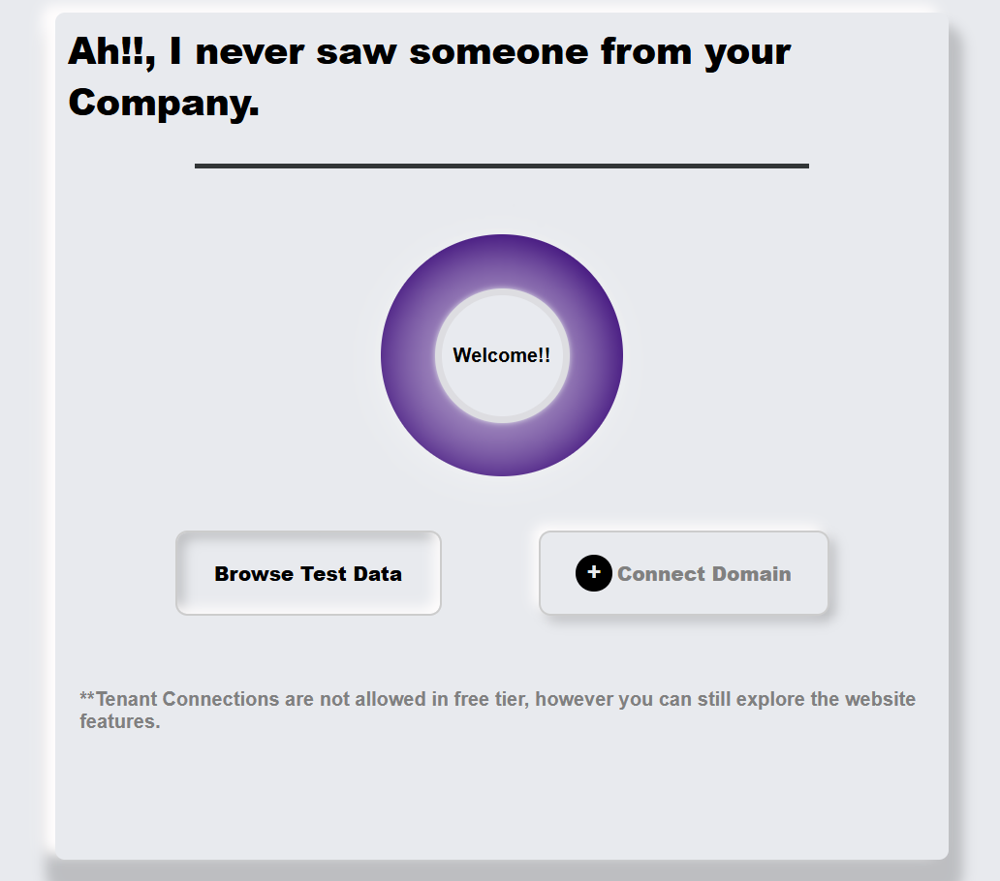

# Animated Welcome Card Component

This project is a **React-based UI component** that creates an animated welcome card using a smooth, continuous circular motion of a blur-styled element.

---

## Overview

The UI presents:

- A professional welcome message  
- A blur-styled outer glowing circle that animates in circular motion  
- Action buttons for user interaction  
- A soft neumorphism-style design  

---

## Features & Implementation Details

### Component: `Card.jsx`

- Uses React hooks: `useState`, `useEffect`
- Core animation logic based on trigonometric functions:

```js
setAngle(prevAngle => (prevAngle + (Math.PI * 2 / 100)) % (Math.PI * 2));
```

- X and Y coordinates are calculated with:

```js
Math.cos(angle) * radius
Math.sin(angle) * radius
```

- These values are applied dynamically to CSS margins to animate a smooth circular loop.

---

### Styling: `card.css`

- Full-page centered layout using **Flexbox**
- Neumorphic shadows for soft 3D feel
- Blur circle created with:

```css
filter: blur(15px);
background: radial-gradient(...);
```

- Two stylish buttons:
  - **Browse Test Data**
  - **Connect Domain** with an `+` icon

---

## State Management

| State    | Purpose                                    |
|----------|--------------------------------------------|
| `xCoord` | Horizontal motion of the glowing circle    |
| `yCoord` | Vertical motion of the glowing circle      |
| `angle`  | Continuously updated to simulate rotation  |

---

## Design Decisions

- **Neumorphism + Flat Design** blend for a modern UI aesthetic  
- Soft color palette with `#e8eaee` and gradient overlays  
- **Responsive-friendly** layout  

---

## How to Run the Project

### Prerequisites

- Node.js ≥ 14.x  
- npm or yarn  

### Installation

```bash
git clone https://github.com/GiriAditya14/react-assignment.git
cd react-assignment
npm install
npm run dev
```

---

## Folder Structure

```bash
├── assignment/
│   ├── .gitignore
│   ├── eslint.config.js
│   ├── index.html
│   ├── package-lock.json
│   ├── package.json
│   ├── vite.config.js
│   ├── node_modules
│   ├── public
│   └── src/
│       ├── App.css
│       ├── App.jsx
│       ├── index.css
│       ├── main.jsx 
│       ├── assets
│       └── component  /
│           ├── card.css
│           └── Card.jsx               
├── governsafe/
│   ├── onboarding.gif
│   └── README.md
└── README.md
```

You can import the `Card` component and its stylesheet into any React app:

```js
import Card from './Card.jsx';
import './card.css';
```

---

## Image



---

## Challenges Faced

- **Smooth Animation Loop:**  
  Achieving fluid motion without libraries like Framer Motion using native trigonometry.

- **State Syncing:**  
  Handling `setInterval` updates while avoiding stale closures.

- **Performance Optimization:**  
  Frequent 20ms updates can impact performance.

---

